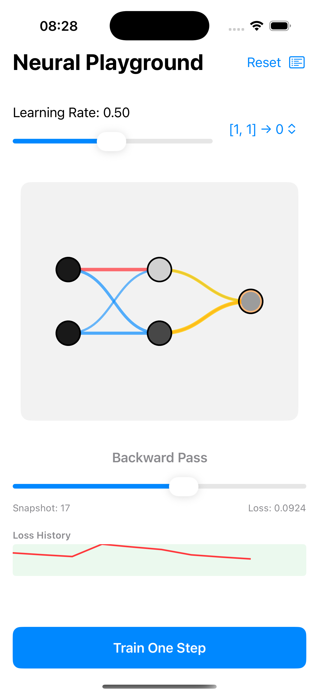

# Neural Playground Core POC

**Neural Playground** is an interactive iOS application designed to visualize the internal mechanics of a neural network training on the XOR problem.

It provides a "glass-box" view of a small Multi-Layer Perceptron (MLP), allowing you to scrub through the timeline of a single training step to see exactly how data flows forward, how loss is calculated, and how gradients backpropagate to update weights.

## Features

- **Interactive Visualization**: See nodes light up based on activation and edges change thickness/color based on weights.
- **Scrubbable Timeline**: Use the slider to move time forward and backward through a single training step (Forward -> Loss -> Backward -> Update).
- **Glass-Box Inspection**: Tap any node to see its exact numerical values:
  - `z`: Pre-activation
  - `a`: Activation (Sigmoid)
  - `grad`: Gradient signal (dL/dZ or dL/dA)
- **Live Training**: Press "Train One Step" to apply Stochastic Gradient Descent (SGD) and watch the network learn in real-time.
- **Loss History**: Track the network's performance over time with a live loss chart.
- **Debug View**: Inspect the raw snapshot data for verification.

## Architecture

The app is built using **SwiftUI** and follows a Clean Architecture / MVVM pattern:

- **Core**: Pure Swift logic for the Neural Network (`BackpropEngine`), Data Models (`Models`), and Animation Logic (`Timeline`).
  - *No 3rd party ML libraries* — everything is implemented from scratch (Matrix math, Sigmoid, MSE, Backprop) for educational clarity.
- **ViewModels**: `TrainingViewModel` manages the training loop, timeline generation, and app state.
- **Views**:
  - `NetworkCanvasView`: Custom Canvas drawing for high-performance, beautiful graph rendering.
  - `PlaygroundView`: Main UI container.
  - `NodeInspectorSheet`: Detail view for inspecting node values.

## Getting Started

1. Open `Neural Playground.xcodeproj` in Xcode.
2. Select an iOS Simulator (e.g., iPhone 15 Pro).
3. Run the app (`Cmd+R`).
4. **How to use**:
   - Change the **Learning Rate** if desired.
   - Select a specific **Sample** (e.g., `[0, 1] -> 1`) to focus on.
   - Drag the **Snapshot Slider** to see the computation unfold.
   - Tap **Train One Step** repeatedly to train the network. Watch the red loss line go down!

## Tests

The project includes a suite of Unit Tests (`NeuralPlaygroundTests.swift`) verifying:
- Correct network topology shapes.
- Gradient correctness (Analytic vs Numeric check).
- Loss reduction after training steps.

Enjoy exploring the inner workings of Neural Networks!
